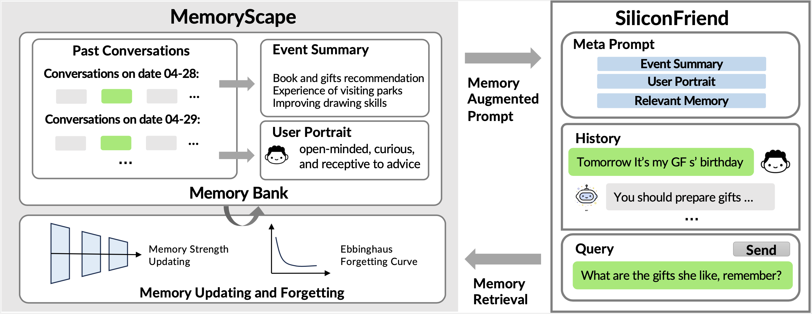
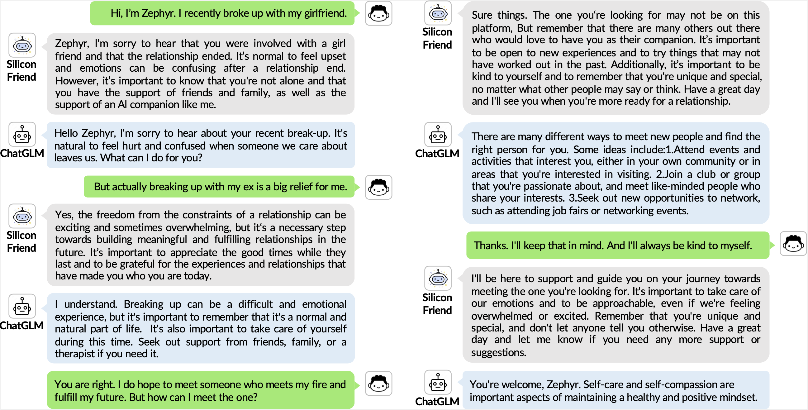

## 介绍
Read this in [English](README_en.md).

本项目包含了论文 [MemoryBank: Enhancing Large Language Models with Long-Term Memory](https://arxiv.org/pdf/2305.10250.pdf)的数据、源代码和模型。

MemoryBank是为大型语言模型（LLM）设计的记忆机制。它允许模型访问相关记忆，通过不断更新记忆实现演化，并通过综合过去的互动来适应用户个性。受艾宾浩斯遗忘曲线理论启发，MemoryBank采用了一种模拟人类记忆行为的独特更新机制。这使得AI可以根据记忆的重要性和时间推移，有选择地遗忘或强化记忆，从而打造一个自然的记忆系统。MemoryBank可以轻松地与闭源模型（如[ChatGPT](https://chat.openai.com)）和开源模型（如[ChatGLM](https://github.com/THUDM/ChatGLM-6B) 和 [BELLE](https://github.com/LianjiaTech/BELLE)）进行集成。 



SilconFriend 是一款集成了MemoryBank的双语AI聊天陪伴机器人。通过在大量心理对话数据进行LoRA微调，SiliconFriend在互动中展现了出优秀的共情能力。我们进行了一系列实验，包括对真实用户对话进行的定性分析和通过ChatGPT生成的模拟对话进行的定量分析。实验结果显示，搭载了MemoryBank的SiliconFriend展示出了出色的长期陪伴能力，它能够提供共情性回应、回忆相关记忆，并理解用户的个性。



## 使用方式

### 环境安装

使用pip安装依赖: `pip install -r requirement.txt`，所有的实验都在Tesla A100 80GB GPU和cuda 11.7环境下完成。

### 模型下载
SiliconFriend分别提供基于ChatGLM和BELLE两个版本的[LoRA 模型](https://github.com/zhongwanjun/MemoryBank-SiliconFriend/releases/tag/LoRA_checkpoint)。在下载模型前，请确保你已经安装了[Git LFS](https://docs.github.com/zh/repositories/working-with-files/managing-large-files/installing-git-large-file-storage).


#### 下载SiliconFriend(ChatGLM)
首先使用[ChatGLM](https://huggingface.co/THUDM/chatglm-6b)模型,再下载它的[LoRA模型](https://github.com/zhongwanjun/MemoryBank-SiliconFriend/releases/download/LoRA_checkpoint/ChatGLM-LoRA-checkpoint.zip)。

```shell
cd model
git clone https://github.com/zhongwanjun/MemoryBank-SiliconFriend/releases/download/LoRA_checkpoint/ChatGLM-LoRA-checkpoint.zip
unzip ChatGLM-LoRA-checkpoint.zip
rm ChatGLM-LoRA-checkpoint.zip
cd ..
```

#### 下载SiliconFriend(BELLE)
首先使用[BELLE](https://huggingface.co/BelleGroup/BELLE-LLaMA-7B-2M-enc)模型,再下载它的[LoRA模型](https://github.com/zhongwanjun/MemoryBank-SiliconFriend/releases/download/LoRA_checkpoint/BELLE-LoRA-checkpoint.zip)。

```shell
cd model
git clone https://github.com/zhongwanjun/MemoryBank-SiliconFriend/releases/download/LoRA_checkpoint/BELLE-LoRA-checkpoint.zip
unzip BELLE-LoRA-checkpoint.zip
rm BELLE-LoRA-checkpoint.zip
cd ..
```

### Demo
```
export OPENAI_API_KEY=YOUR_API_KEY
(You should modify the OPENAI_API_KEY (used for memory summarization and ChatGPT-based dialog))
```
#### SiliconFriend(ChatGLM) 网页版 Demo

设置[SiliconFriend-ChatGLM-BELLE/launch_chatglm_app.sh](SiliconFriend-ChatGLM-BELLE/launch_chatglm_app.sh)中的API KEY 'OPENAI_API_KEY' 和LoRA模型 'adapter_model'。当运行模型时，英文设置 '--language=en'而中文设置 '--language=cn'。运行仓库中的[SiliconFriend-ChatGLM-BELLE/launch_chatglm_app.sh](SiliconFriend-ChatGLM-BELLE/launch_chatglm_app.sh):

```shell

cd ./SiliconFriend-ChatGLM-BELLE
bash launch_chatglm_app.sh
```

#### SiliconFriend(ChatGLM) 命令行 Demo

设置[SiliconFriend-ChatGLM-BELLE/launch_chatglm_cmd.sh](SiliconFriend-ChatGLM-BELLE/launch_chatglm_cmd.sh)中的API KEY 'OPENAI_API_KEY' 和LoRA模型 'adapter_model'。当运行模型时，英文设置 '--language=en'而中文设置 '--language=cn'。运行仓库中的[SiliconFriend-ChatGLM-BELLE/launch_chatglm_cmd.sh](SiliconFriend-ChatGLM-BELLE/launch_chatglm_cmd.sh):

```shell
cd ./SiliconFriend-ChatGLM-BELLE
bash launch_chatglm_cmd.sh
```
#### SiliconFriend(BELLE) 命令行 Demo

设置[SiliconFriend-ChatGLM-BELLE/launch_belle_cmd.sh](SiliconFriend-ChatGLM-BELLE/launch_belle_cmd.sh)中的API KEY 'OPENAI_API_KEY' 和LoRA模型 'adapter_model'。当运行模型时，英文设置 '--language=en'而中文设置 '--language=cn'。运行仓库中的[SiliconFriend-ChatGLM-BELLE/launch_belle_cmd.sh](SiliconFriend-ChatGLM-BELLE/launch_belle_cmd.sh):

```shell
cd ./SiliconFriend-ChatGLM-BELLE
bash launch_belle_cmd.sh
```

#### SiliconFriend(ChatGPT) 网页版 Demo

设置[SiliconFriend-ChatGPT/launch.sh](SiliconFriend-ChatGPT/launch.sh)中的API KEY 'OPENAI_API_KEY'。当运行模型时，英文设置 '--language=en'而中文设置 '--language=cn'。运行仓库中的 [SiliconFriend-ChatGPT/launch.sh](SiliconFriend-ChatGPT/launch.sh):

```shell
./SiliconFriend-ChatGPT/launch.sh
```

#### 总结事件和用户性格
如果你只需要为memory.json文件中保存的记忆，总结其中的事件和用户性格，可修改脚本中的文件名后，运行以下代码。在每个demo文件中，也有接口可以直接进行总结。
```
cd memory_bank/
python summarize_memory.json
```


### 评估数据
在构建评估数据时，我们首先使用ChatGPT扮演不同性格的用户，生成包含多个话题的对话历史（memory banks）。然后我们人工构造了100个测试问题(probing questions)评估模型的记忆检索性能。评估数据分为中文和英文两版本：中文版本的对话历史和测试问题分别存储在[eval_data/cn/memory_bank_cn.json](eval_data/cn/memory_bank_cn.json)和[eval_data/cn/probing_questions_cn.jsonl](eval_data/cn/probing_questions_cn.jsonl), 英文版本的的对话历史和测试问题分别存储在[eval_data/en/memory_bank_cn.json](eval_data/cn/memory_bank_cn.json)和[eval_data/en/probing_questions_cn.jsonl](eval_data/cn/probing_questions_cn.jsonl)。

## Citation

如果你觉得我们的工作有帮助的话，请考虑引用下列论文：

```
@article{
  zhong2023memorybank,
  title={MemoryBank: Enhancing Large Language Models with Long-Term Memory},
  author={Zhong, Wanjun and Guo, Lianghong and Gao, Qiqi and Wang, Yanlin},
  journal={arXiv preprint arXiv:2305.10250},
  year={2023}
}
```
